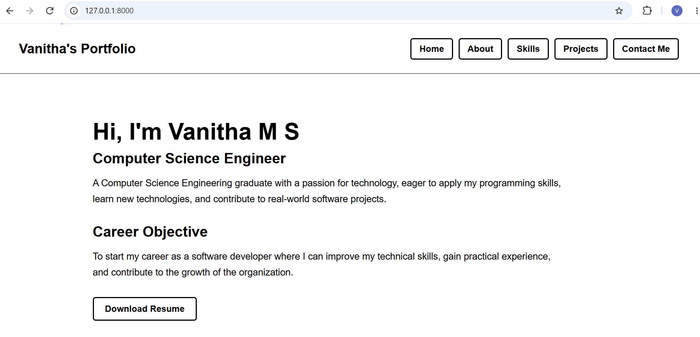
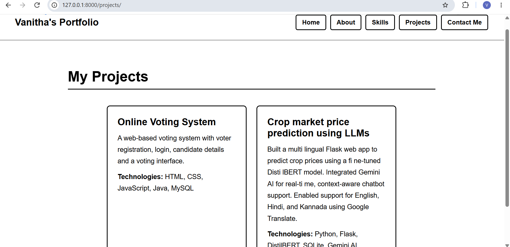
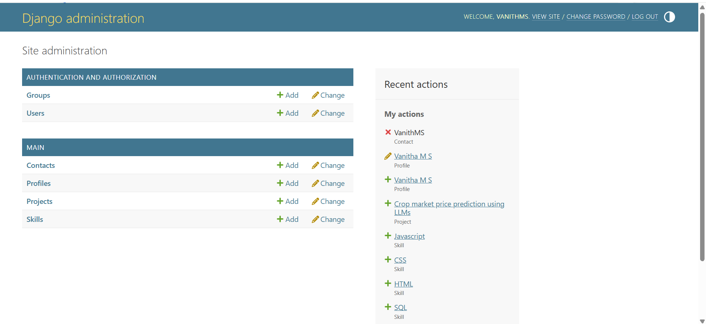

\# Vanitha M S - Portfolio Website

\## About the Project

This is my personal portfolio website developed to showcase my

education, technical skills, projects, and contact information.

The website is built using Django and SQLite with a simple and

professional design.

\## Technologies Used

\- Python

\- Django

\- HTML

\- CSS

\- SQLite

\- Django Admin

\## Features

\- Home page

\- About Me page

\- Education details

\- Skills section

\- Projects section

\- Contact Me form

\- Django Admin for managing portfolio data

\- SQLite database for storing information

\## Projects Included

\### 1. Online Voting System

A web-based voting system with voter registration, login,

candidate details, and a voting interface.

\*\*Technologies:\*\*

HTML, CSS, JavaScript, Java, MySQL

\### 2. Crop Market Price Prediction Using LLMs

A team project developed to predict crop prices and provide

agricultural guidance using NLP and AI technologies.

\*\*Technologies:\*\*

Python, Flask, DistilBERT, SQLite, Gemini AI, Google Translate

\## Education

\*\*B.E. in Computer Science and Engineering\*\*

Bapuji Institute of Engineering and Technology

\*\*CGPA:\*\* 8.71

## Project Output

### Home Page

### Projects

### Django Admin

## Author

Vanitha M S

